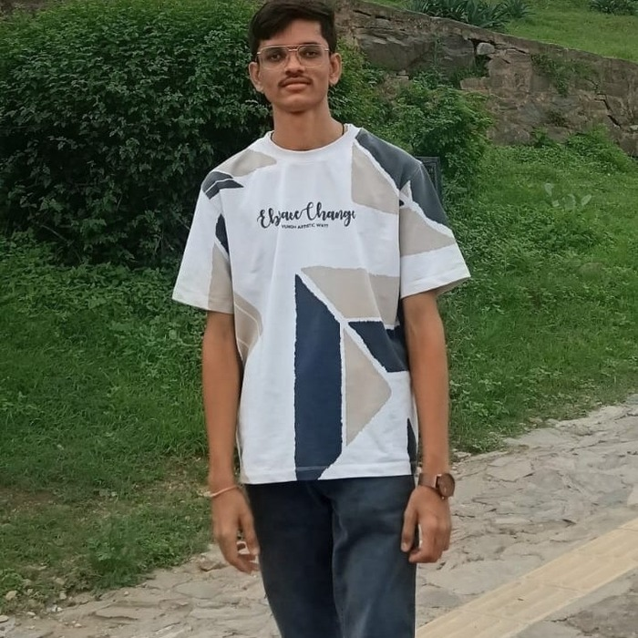

<div align="center">


<p>
  <a href="https://github.com/Jainamsheth06">
    
  </a>
</p>

</div>

---

## 👨‍💻 About Me

I'm **Jainam Sheth**, a **BSc CS-IT student** focused on backend development with
**Python and Django**.

I enjoy turning ideas into practical web applications, building REST APIs,
working with databases, and learning through real-world projects.

- 🎓 **BSc CS-IT Student**
- 🐍 **Python Backend Developer**
- ⚡ **Django & Django REST Framework**
- 🔗 **REST API Development**
- 🗄️ **SQL & MySQL**
- 🛠️ **Git, GitHub & VS Code**
- 📍 **Ahmedabad, Gujarat, India**

---

## 🧰 Tech Stack

<div align="center">

### Backend & Programming


### Database & Tools


</div>

---

## 🚀 Featured Project

### 🏥 Medinexa — Hospital Management System

**Medinexa** is a Django-based hospital management project built to organize
healthcare-related workflows through a web application.

**Core technologies:**

```text
Python • Django • SQL • HTML/CSS • REST APIs
```

The project reflects my interest in building **practical, real-world backend
systems** rather than only tutorial-based applications.

---

## 🎯 What I'm Working On

```text
Python
   ↓
Django
   ↓
Django REST Framework
   ↓
REST APIs
   ↓
SQL / Databases
   ↓
Real-World Applications
```

I'm continuously improving my backend development, API design, database,
and problem-solving skills by building and refining projects.

---

## 📊 GitHub Activity

<div align="center">


<br><br>


</div>

---

## 📸 A Little More About Me

<div align="center">

<table>
<tr>
<td align="center">

<br>
<b>Professional</b>
</td>
<td align="center">

<br>
<b>Outside the Desk</b>
</td>
</tr>
</table>

</div>

---

## 🌱 Goals

- 🚀 Grow into a strong **Python Backend Developer**
- 🧠 Deepen my **Django & Django REST Framework** skills
- 🔗 Build clean and scalable **REST APIs**
- 🗄️ Strengthen **SQL and database** knowledge
- 💼 Work on meaningful **real-world software projects**
- 📚 Keep learning, building, and improving


## 📈 My Development Mindset

<div align="center">

**LEARN → BUILD → TEST → IMPROVE → REPEAT 🔁**

</div>

## 📫 Connect With Me

<div align="center">

<a href="https://github.com/Jainamsheth06">
  
</a>

<a href="https://www.linkedin.com/in/jainam-sheth-2106-jmsheth">
  
</a>

<a href="https://www.instagram.com/elevationpositively">
  
</a>

</div>

> 💬 **Open For Learning, Collaboration And Building Useful Projects.**
<div align="center">

### 💡 Learning. Building. Improving. 🚀

⭐ **Thanks for visiting my profile!**

</div>
